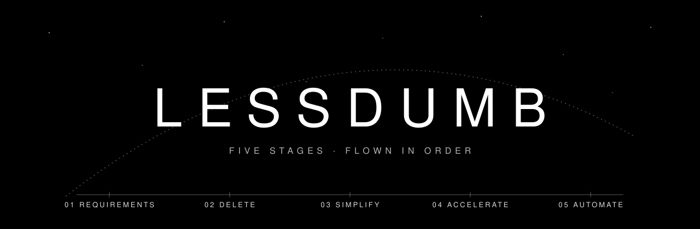

<p align="center">
  
</p>

<p align="center">
  <b>An agent skill that questions requirements and deletes parts<br>before it optimises or automates anything.</b>
</p>

<p align="center">
  <a href="LICENSE"></a>
  
  
</p>

---

## Mission

Agents launch at stage 5. Ask one to script a 13-step manual deploy and it
scripts all 13. In our test, Claude without this skill kept an idle celery
restart and a `redis-cli FLUSHALL` nobody could explain, as opt-in flags. With
the skill loaded, it deleted both before it wrote a line of bash.

lessdumb flies the 5-step design process Elon Musk described on the 2021
Starbase tour with Tim Dodd (Everyday Astronaut). The stages run in order,
because each one stops you spending effort on the next.

## Flight profile

| Stage | | Burn |
|:-:|---|---|
| **01** | **Requirements** | Make them less dumb. Every requirement gets a person as its owner, including the ones from someone smart. |
| **02** | **Delete** | Cut the part or process. If you aren't adding back ~10% of what you cut, you didn't cut enough. |
| **03** | **Simplify** | Optimise only what survived, after looking at the whole vehicle. |
| **04** | **Accelerate** | Shorten the loop at the bottleneck, not where it's easy. |
| **05** | **Automate** | Last, and only what has been flown by hand long enough to show its edge cases. |

> "Possibly the most common error of a smart engineer is to optimise a thing
> that should not exist."

## What happens on a run

The skill writes a short review under the five stages, then acts on the
smaller plan that survives. It builds the reduced feature, deletes dead parts
as their own change, or hands back the shorter version of your proposal. Every
review ends with a **net** line (13 steps → 8, 71 lines → 58), because the
review has to obey stage 02 too.

It holds for two things only: questions it can't answer without you, and
deletions that touch money, security, user data or a destructive operation.

It fires on its own when you ask to design, simplify, refactor, automate or
review a plan, and on `/lessdumb`.

## Pre-flight

**Claude Code plugin**

```
/plugin marketplace add enkhbold470/lessdumb
/plugin install lessdumb@lessdumb
```

**Claude Code, by hand**

```sh
git clone https://github.com/enkhbold470/lessdumb
cp -r lessdumb/skills/lessdumb ~/.claude/skills/
```

**Any other agent:** copy `skills/lessdumb/SKILL.md` to wherever your agent
loads skills or rules. It is plain Markdown with YAML frontmatter.

## Test stand

Three test prompts live in [`evals/`](evals/), with their input files:

| Fixture | The request |
|---|---|
| `exporter.py` | A small CSV exporter, plus asks for retries, YAML config and a plugin system. |
| `release-proposal.md` | A weekly release train with a code freeze and change board, aimed at incidents caused by untested migrations. |
| `deploy-steps.md` | A 13-step manual deploy to be scripted. |

Run each with and without the skill and compare what gets built.
`evals/evals.json` lists the checks.

## Why one skill, not six

[wezendy/elon-musk-algorithm-skills](https://github.com/wezendy/elon-musk-algorithm-skills)
flies the same algorithm as six skills, each with a gate and a form to fill
in. lessdumb keeps it to one file. Six overlapping triggers ("optimize this",
"refactor", "script this") load gated steps into everyday requests, and a
review longer than the thing it reviews has added parts. Several ideas here
came from that repo: moving a guarantee before deleting the code that held it,
the 25% ceiling on add-backs, targeting the bottleneck, and planning how to
undo an automation.

## Contributing

Issues and pull requests are welcome. If you change `SKILL.md`, run the three
evals before and after, and say in the PR what changed in the output.

## License

[MIT](LICENSE). Not affiliated with or endorsed by Elon Musk, SpaceX or Tesla.
The five steps are his; the wording and the mistakes in this skill are mine.
